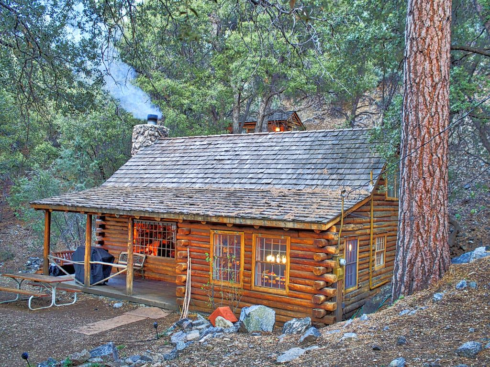

## ImageSim

How similar are these images to each other?




Given a directory of JPEG images, calculate how similar each image is to every other image.

NOTE: This code is a modified version of Google's TensorFlow tutorial on the Inception model to show similarity between images, my contribution is primarily in dockerizing for ease of use.

### Prereqs

1. Docker (tested with version 2.0.0.0-mac81 (29211), Docker Engine 18.09.0)

### Build

First, build the two docker images, `imagesim-vectorize` and `imagesim-cluster` with the follow command:

```
./build
```

This will take a few minutes as an Ubuntu base environment is downloaded with support for CUDA enabled Tensorflow libraries.

### Run

Now, generate image similarity values for the included cabin and modern house images with the run command:

```
./run
```

You should now have an `out` directory in your project containing the similarity values for all your input images. The similarity values look like this:

```
imagesim (master) $ cat out/cabin0.json
[{"similarity": 1.0, "filename": "cabin0"}, {"similarity": 0.791, "filename": "cabin2"}, {"similarity": 0.756, "filename": "cabin3"}, {"similarity": 0.7449, "filename": "cabin1"}, {"similarity": 0.6627, "filename": "modern0"}, {"similarity": 0.6289, "filename": "modern3"}, {"similarity": 0.5995, "filename": "modern2"}, {"similarity": 0.5952, "filename": "modern1"}]
```

Now try adding your own .jpg image to the `images` directory and see how similar it is to the existing images!

### :snake: Anaconda :snake:

I wanted to include a project that shows my comfort working with and understanding of machine learning solutions. Specifically of how to package the often complicated and numerous machine learning library dependencies.

Also I think Google's inception model is just amazing in how it can generalize. It works with pictures of houses as shown above, but also with pictures of animals, art, cars, you name it.
